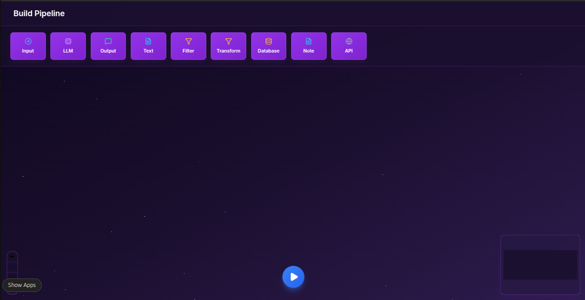

---

# VectorShift Assessment - Pipeline Builder



A builder application consisting of a React-based drag-and-drop frontend and a FastAPI backend. This application allows users to construct node-based pipelines, manage dynamic variable dependencies, and validate the structural integrity (DAG check) of the graph.

## Features

### **Frontend (React + React Flow)**

* **Modular Node Architecture**: Built on a highly reusable `BaseNode` abstraction to ensure consistent behavior and styling across all node types.
* **Dynamic Text Node**:

  * **Variable Extraction**: Automatically parses variables (e.g., `{{ prompt }}`) and creates corresponding input handles dynamically.
  * **Debounced Parsing**: Optimized regex execution prevents UI stutter during rapid typing.
  * **Auto-Resizing**: Text areas expand seamlessly to fit content.
* **Polished UI/UX**:

  * **Unified Design System**: Consistent typography, spacing, and shadows using Tailwind CSS.
  * **Custom Interactive Elements**: Replaced native browser dropdowns with custom React components for a unified visual experience.
  * **Interactive Results**: Beautiful modal displays pipeline analysis (Node/Edge count, DAG validity).
* **Performance**:

  * Memoized components (`React.memo`) to minimize re-renders.
  * Robust state management using `Zustand`.

### **Backend (FastAPI)**

* **Pipeline Validation**: Calculates graph statistics and implements Kahn's Algorithm to strictly validate if the pipeline is a Directed Acyclic Graph (DAG).
* **Resilience**:

  * **Error Handling**: Gracefully handles malformed JSON and data integrity issues.
  * **Data Validation**: Filters out "ghost edges" referencing non-existent nodes to ensure accurate analysis.

---

## Tech Stack

* **Frontend**: React, React Flow, Zustand, Tailwind CSS, Lucide React
* **Backend**: Python, FastAPI
* **Tools**: ESLint, PostCSS, Concurrently

---

## Getting Started

### **Prerequisites**

* Node.js (v16+)
* Python (v3.8+)

### **Installation**

#### 1. Backend Setup

Navigate to the backend folder, create a virtual environment, and install dependencies.

```bash
cd backend
python -m venv venv

# Activate virtual environment
# Windows: venv\Scripts\activate
# Mac/Linux: source venv/bin/activate

pip install fastapi uvicorn python-multipart
```

#### 2. Frontend Setup

Navigate to the frontend folder and install dependencies.

```bash
cd frontend
npm install
```

---

## Running the App

I use `concurrently` to run both the React frontend and FastAPI backend with a single command.

1. Ensure your backend virtual environment is active (if you didn't hardcode the path).
2. Run the development command from the `frontend` directory:

```bash
# Runs Frontend (localhost:3000) AND Backend (127.0.0.1:8000)
npm run dev
```

The application will open automatically at **[http://localhost:3000](http://localhost:3000)**.

---

